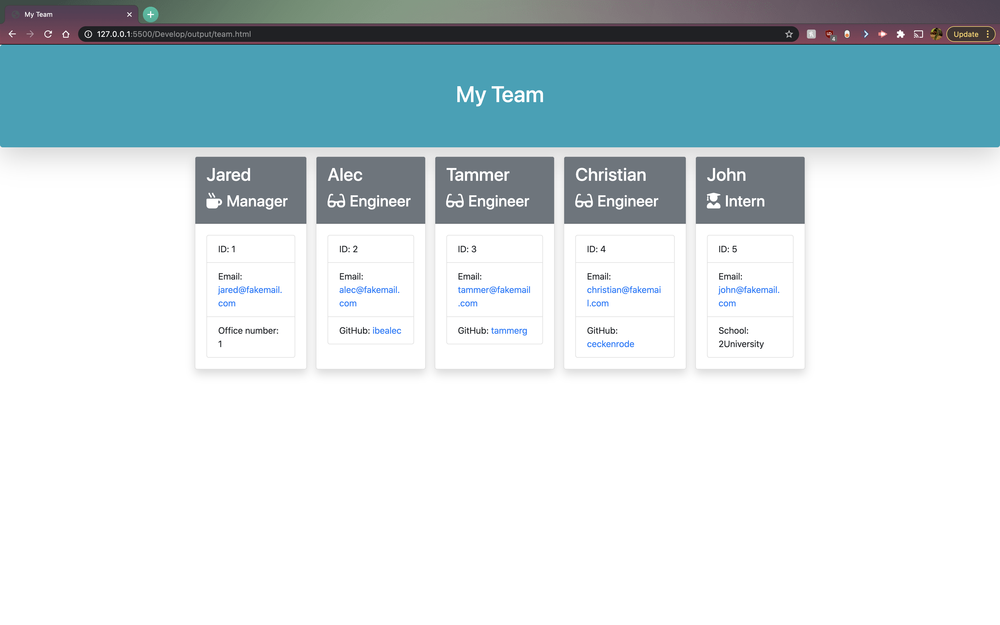
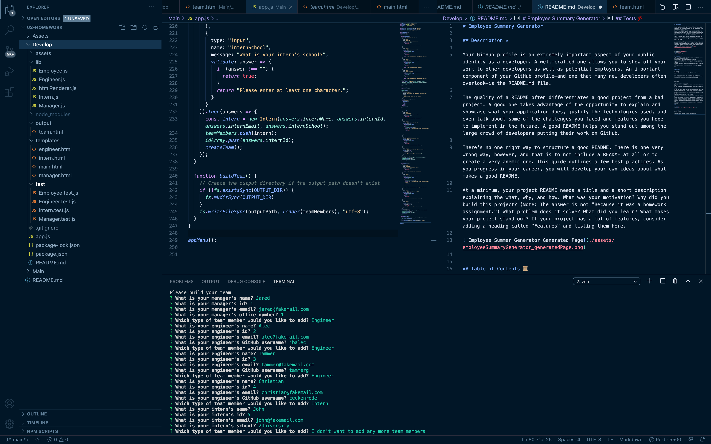

# Employee Summary Generator

## Description ✏️

One of the most important aspects for a Team Manager is knowing their team! This where the Emplyee Summary Generator comes in. When installed, the user is prompted questions about their team members' id, email... etc., to generate a summary page of the team members' professional data at a glance. 




## Table of Contents 📜

* [Installation](#installation)
* [Usage](#usage)
* [License](#license)


## Installation 💾

* Make sure to have a text editor of your choice installed (the example below shows "Visual Studio Code").
* Install node.js here: https://nodejs.org/en/download/
* From the repository download zip file of the repository (found when you click on the green "Code" button)
* Inside your computer's command-line interface, navigate into the file "develop".
* Type in "npm install" to install the dependencies required to run the application.
* From here in the command-line, type in "node app.js" to run the application and prompt the questions required to generate a README.md file.




## Usage 🔧

### User Story:
```
As a manager
I want to generate a webpage that displays my team's basic info
so that I have quick access to emails and GitHub profiles
```

After installation, the user can follow along with the prompted questions in the command-line until they're given the confirmation that the team.html file is successfully written to. From here, the user can navigate to the "output" folder to view the generated README.


## License 🛡️

MIT License

Copyright (c) [2020] [Carmen Hui]

Permission is hereby granted, free of charge, to any person obtaining a copy
of this software and associated documentation files (the "Software"), to deal
in the Software without restriction, including without limitation the rights
to use, copy, modify, merge, publish, distribute, sublicense, and/or sell
copies of the Software, and to permit persons to whom the Software is
furnished to do so, subject to the following conditions:

The above copyright notice and this permission notice shall be included in all
copies or substantial portions of the Software.

THE SOFTWARE IS PROVIDED "AS IS", WITHOUT WARRANTY OF ANY KIND, EXPRESS OR
IMPLIED, INCLUDING BUT NOT LIMITED TO THE WARRANTIES OF MERCHANTABILITY,
FITNESS FOR A PARTICULAR PURPOSE AND NONINFRINGEMENT. IN NO EVENT SHALL THE
AUTHORS OR COPYRIGHT HOLDERS BE LIABLE FOR ANY CLAIM, DAMAGES OR OTHER
LIABILITY, WHETHER IN AN ACTION OF CONTRACT, TORT OR OTHERWISE, ARISING FROM,
OUT OF OR IN CONNECTION WITH THE SOFTWARE OR THE USE OR OTHER DEALINGS IN THE
SOFTWARE.


## Badges ✅


## Tests 💯

Running the test:

* Navigate to the "develop" folder in the command line
* Type in "npm run test"
